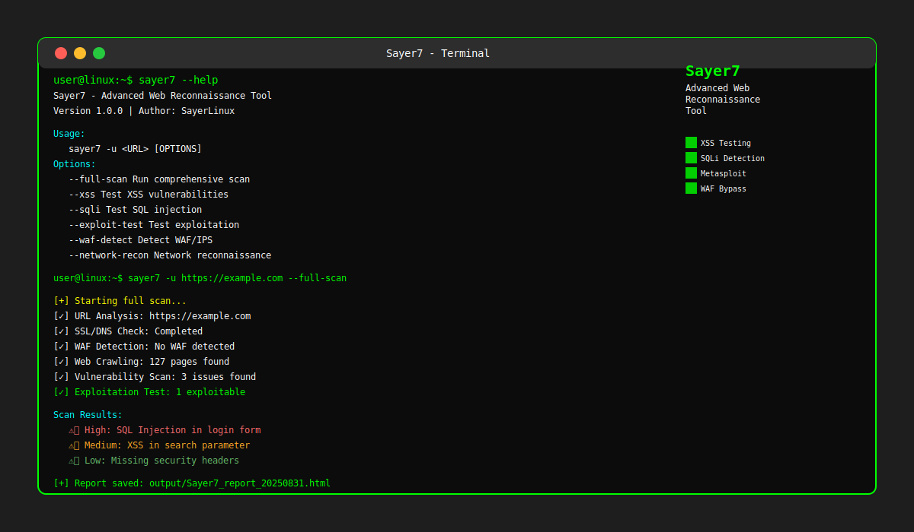
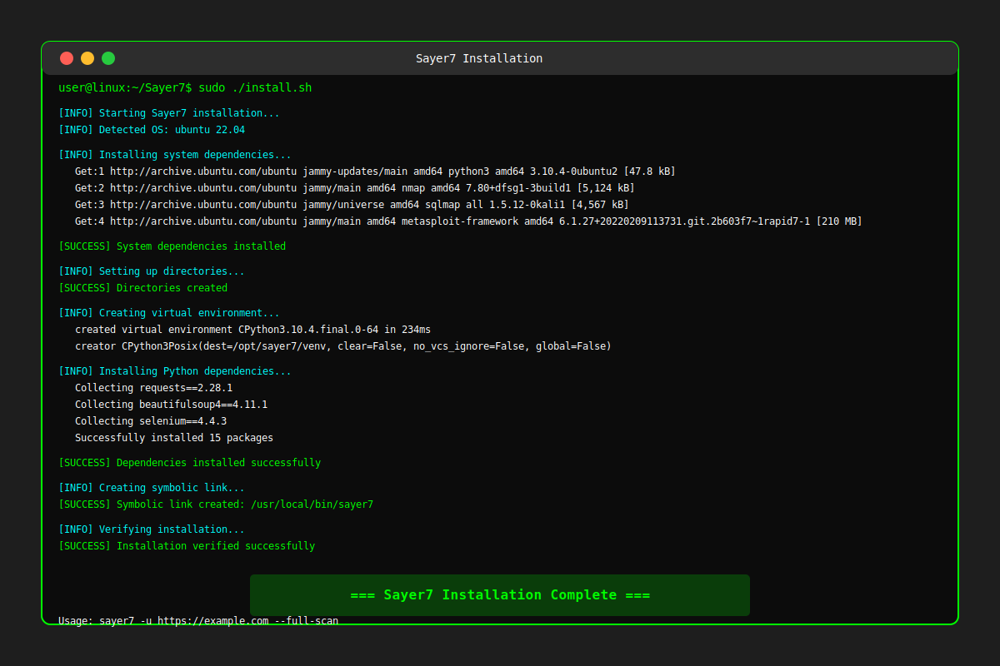

<div align="center">
  <h1>Sayer7 - أداة استطلاع متقدمة لتطبيقات الويب</h1>
  <svg width="200" height="200" viewBox="0 0 200 200">
    <rect width="200" height="200" fill="#1a1a1a"/>
    <text x="100" y="120" font-family="Arial" font-size="60" fill="#00ff00" text-anchor="middle">S7</text>
  </svg>
</div>

## 🔍 نظرة عامة
Sayer7 هي أداة استطلاع متقدمة مصممة لجعل استطلاع تطبيقات الويب أمرًا بسيطًا. تأتي مع مجموعة شاملة من الميزات لتحليل وفحص تطبيقات الويب بشكل فعال.

## ✨ الميزات الرئيسية
- محرك تحليل URL مدمج وقوي
- التوافق مع محركات البحث المتعددة (DuckDuckGo، AOL، Bing، و Google الإفتراضي هو Google)
- القدرة على استخراج عنوان URL من عنوان URL للحظر وذاكرة التخزين المؤقت
- دعم الوكيل (http، https، socks4، socks5)
- توافق وكيل Tor ومحاكاة متصفح Tor
- تحليل robots.txt/sitemap.xml
- فحوصات الثغرات الأمنية المتعددة:
  - XSS (Reflected, Stored, DOM-based)
  - SQLi (Error-based, Blind, Time-based)
  - Clickjacking
  - مسح المنافذ
  - العثور على لوحة الإدارة
  - عمليات البحث عن whois
  - Code Injection (PHP, Python, Node.js)
  - Command Injection
  - LFI/RFI
  - XXE Injection
- اختبار استغلال الثغرات المتقدم مع Metasploit integration
- التلاعب بالنصوص البرمجية لإخفاء حمولات XSS
- أكثر من 4000 وكيل مستخدم عشوائي
- زحف صفحات الويب واستخراج الروابط
- تحديد حماية WAF/IPS/IDS
- فحوصات أمان متقدمة:
  - موازنات تحميل DNS/HTTP
  - جدران حماية تطبيقات الويب
  - فحص أنظمة إدارة المحتوى (Joomla، WordPress، Drupal)
  - ثغرات SSL (HEARTBLEED، FREAK، POODLE، وغيرها)
  - فحص المنافذ المفتوحة
  - نقل منطقة DNS
  - استخدام القوة الغاشمة للمجالات الفرعية والملفات

## 🚀 التثبيت السريع (Linux)
```bash
git clone https://github.com/SaudiLinux/Sayer7.git
cd Sayer7
sudo chmod +x install.sh
sudo ./install.sh
```

## 🛠️ التثبيت اليدوي
```bash
git clone https://github.com/SaudiLinux/Sayer7.git
cd Sayer7
pip install -r requirements.txt
```

## 📖 الاستخدام
```bash
# عرض المساعدة
sayer7 --help

# إجراء فحص كامل (بما في ذلك اختبار الاستغلال)
sayer7 -u https://example.com --full-scan

# فحص أنواع محددة من الثغرات
sayer7 -u https://example.com --xss        # فحص XSS فقط
sayer7 -u https://example.com --sqli       # فحص SQLi فقط
sayer7 -u https://example.com --exploit-test  # اختبار استغلال الثغرات

# فحص متعدد الخطوات
sayer7 -u https://example.com --waf-detect  # اكتشاف WAF
sayer7 -u https://example.com --network-recon # استطلاع الشبكة
```

## 📸 لقطات الشاشة

### Sayer7 في العمل


### عملية التثبيت


### مثال على نتائج الفحص
يوفر الأداة تقارير مفصلة مع مستويات خطورة ملونة:
- 🔴 ثغرات عالية الخطورة
- 🟡 مشكلات متوسطة الخطورة
- 🟢 نتائج منخفضة الخطورة

## 👨‍💻 المطور
- **المطور**: SayerLinux
- **الموقع**: [https://github.com/SaudiLinux](https://github.com/SaudiLinux)
- **البريد الإلكتروني**: SayerLinux1@gmail.com

## 📝 ملاحظات مهمة

### للمستخدمين على أنظمة Linux
يوفر Sayer7 سكربت تثبيت متقدم عبر `install.sh` يقوم بتثبيت جميع التبعيات النظامية والأدوات المطلوبة تلقائيًا:
- Python3 و pip
- nmap و masscan
- sqlmap و metasploit-framework
- dnsutils و whois
- إنشاء روابط سهلة الاستخدام في /usr/local/bin

### للأنظمة الأخرى (Windows/macOS)
استخدم سكربت التثبيت `install.py` للتثبيت الأساسي:
```bash
python install.py
```

## 📄 الترخيص
هذا المشروع مرخص تحت رخصة MIT. انظر ملف [LICENSE](LICENSE) لمزيد من التفاصيل.